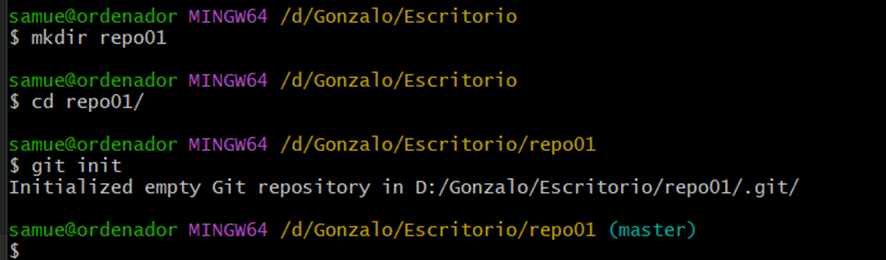
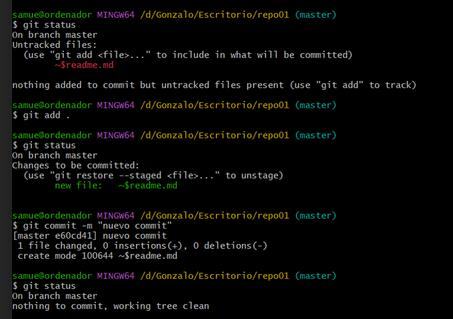
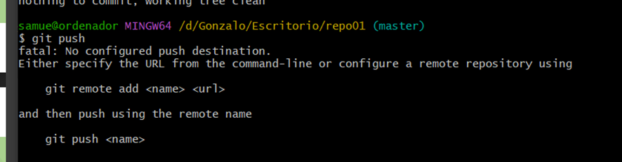
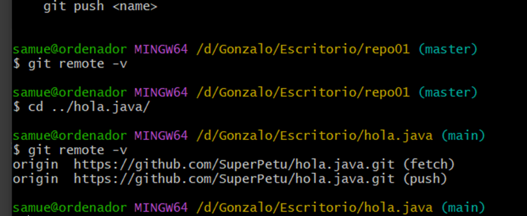
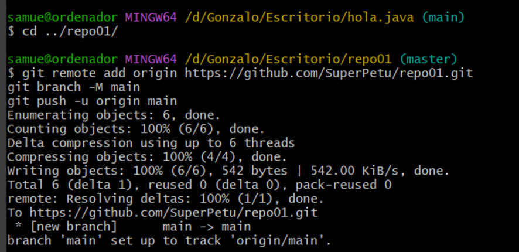
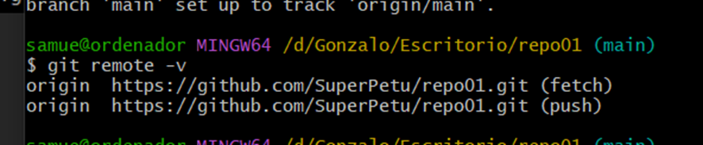
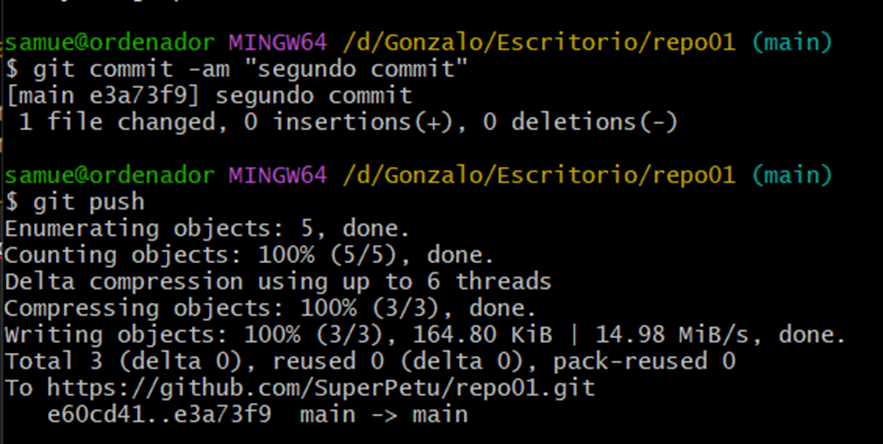

1.1: 

1.2: 
Simplemente entré en la carpeta y creé el archivo “readme.md”

1.3
 

1.4
 

Esto ocurre debido a que no tiene un lugar donde ir, no le hemos asignado un servidor (como un repositorio en github) para ir.

1.5
 
No sale nada porque este comando sirve para saber a donde van los push (como podemos ver en el ejemplo de hola.java). Aqui, como he dicho antes, no aparece nada debido a que no tiene un destino.

1.6
 

1.7
 
Aparece porque ahora sí que lo hemos configurado para que los pushes vayan al repo01 de github.

1.8
 

1.9
No he encontrado nada peculiar. El readme y las fotos se han subido con exito con la descripción del commit a la derecha y el tiempo que ha pasado desde que se ha hecho el push.

yappiiiasdasdasdasdasdnggggg